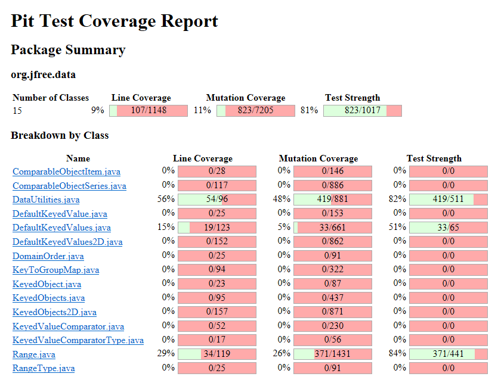
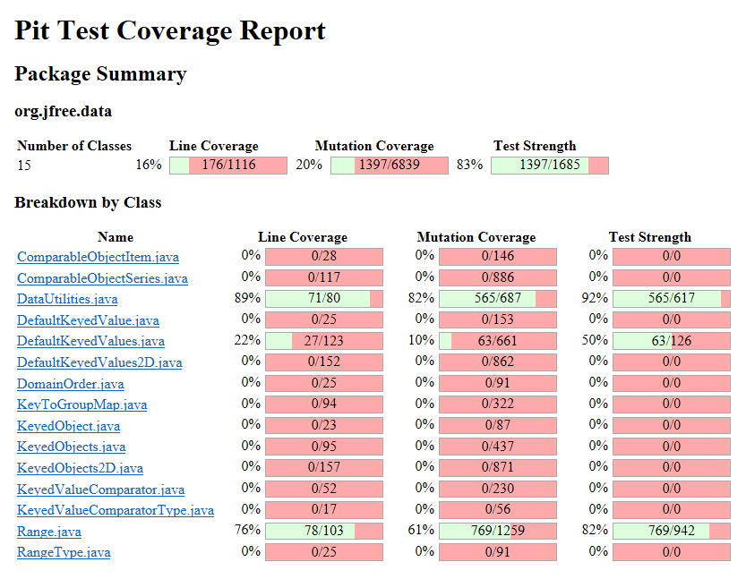

**SENG 637 - Dependability and Reliability of Software Systems**

**Lab. Report \#4 – Mutation Testing and Web app testing**

| Group 8:      |     |
| -------------- | --- |
|Student Names |     |
|Amir Allahveran                 |  30216696   |
|Sepehr Ganji                |   30223725  |
|Zahra Arabi Narei         |  30191990   |
|Sara Montajab          |  30221523   |
|Amirhossein Foroughi          |  30228075   |

# Introduction

Two main topics will be covered in this assignment: 
- mutation testing 
- GUI/web testing

First, we will use the **Pitest** eclipse plugin to perform mutation testing and assess the effectiveness of our test suite in detecting bugs. **Mutation testing**, is a method used to assess the quality and potential weaknesses of a test suite by introducing modified code to see if they are detected and killed by the current test suite. We aim to enhance our test suite by adding new test cases that can boost our mutation score by a minimum of 10%.

Then, we are focusing on the importance of automating web and GUI testing, To demonstrate GUI testing, we will utilized **Selenium** IDE to test few different functionalities of the website.

# Analysis of 10 Mutants of the Range class 

|No.| Method |         Mutation        |    Code Section (line)   |    Analysis     |
|---|--------|-------------------------|--------------------------|-----------------|
| 1 | combineIgnoringNaN(Range, Range) | removed conditional - replaced equality check with false → KILLED | `if (range1.isNaNRange())` (line #248) | 
 This mutation replaces the conditional statement with `false`. This happens when the input range1 is not null and range2 is null. In situations where range1 is NaN, the expected behavior is for the method to return null. However, due to the mutation, range1 is returned instead. As a result, our test case named combineIgnoringNaNWithFirstRangeNaNSecondRangeNull does not pass because of this mutation. Hence this mutation was killed. 

| 2 | expandToIncludeintersects(double, double) | Incremented (a++) double local variable number 3 → SURVIVED | `return (b0 < this.upper && b1 >= b0);` (line #161) | 
 This mutation tries to update the value of b1 by 1 using post-increment operator. Since b1 is used only once in the statement, this mutation has no effect on the outcome of the test case. Hence it behaves like an equivalent mutation, which cannot be killed. 

| 3 | expandToIncludeintersects(double, double) | Decremented (a--) double local variable number 3 → SURVIVED | `return (b0 < this.upper && b1 >= b0);` (line #161) | 
 This mutation tries to update the value of b1 by 1 using post-decrement operator. Since b1 is used only once in the statement, this mutation has no effect on the outcome of the test case. Hence it behaves like an equivalent mutation, which cannot be killed. 

| 4 | expandToInclude(Range, double) | changed conditional boundary → SURVIVED | `if (value < range.getLowerBound())` (line #305) | 
 This mutation changes the condition `value < range.getLowerBound()` to `value <= range.getLowerBound()`. Examining the original function we can see this results in an equivalent mutation. For example, with range (-10, 10) and value of -10 the final else statement would be executed and the original range is returned. The mutation of `<` to `<=` results in the line `return new Range(value, range.getUpperBound());` being executed instead. However the new range would still be (-10, 10), which is same result as returning the original range. Therefore this is an equivalent mutation and can not be killed.

| 5 | expandToInclude(Range, double) | removed conditional - replaced comparison check with false → KILLED | `if (value < range.getLowerBound())` (line #305) | 
 This mutation replaces the conditional with `false`. This method uses a range of (-10, 10) and value of -10.00001. Using these numbers, when the conditional in the if statement is replaced with `false`, the else statement will be executed instead. This returns the orignal range and does not expand it as intended. As the returned range does not match the expected range, the test fails and this mutation is killed. 

| 6 | intersects(double, double) | changed conditional boundary → KILLED | `return (b0 < this.upper && b1 >= b0);` (line #161) | 
 This mutation changes the condition `b0 < this.upper` to `b0 <= this.upper`. One of our test case `intersectsWithInputUBAndAUB` tests this boundary, by supplying `b0` equal to `this.upper`. With original code, the test case passes as the method returns `false`. However, the mutation causes the method to return `true` and the test case fails. Hence this mutation was killed. 

| 7 | shift(Range, double, boolean) | removed call to org/jfree/chart/util/ParamChecks::nullNotPermitted → KILLED | `ParamChecks.nullNotPermitted(base, "base");` (line #365) | 
 This mutation removes the call to the above line. The method call throws `IllegalArgumentException` if the parameter base is null. One of our test cases that tests base as null for this method, the removal of the call to `ParamChecks.nullNotPermitted()` tests this. With original code, the test case passes as the method returns `false`. However, the mutation causes the method to return `true` and the test case fails. Hence this mutation was killed. 

| 8 | isNaNRange() | replaced boolean return with false for org/jfree/data/Range::isNaNRange → KILLED | `return Double.isNaN(this.lower) && Double.isNaN(this.upper);` (line #448) | 
 This mutation replaces the whole boolean statement with `false`. This change propagates to the output of the method, as all the test cases will fail even if both the lower and upper bounds are equal to `Double.NaN`. This will make one of our test case isNaNRangeWithBothBoundNaN` fail. Hence this mutation was killed. 

| 9 | isNaNRange() | Negated double field lower → SURVIVED | `return Double.isNaN(this.lower) && Double.isNaN(this.upper);` (line #448) | 
 This mutation negates the `this.lower` before feeding to `Double.isNaN`. Since `Double.isNaN` return true only for NaN, this mutation will not have any impact on the output of the method. For example, if `this.lower` is equal to 30, then `Double.isNaN` will return `false` both 30 and -30. So this mutation will not be killed any test cases.

| 10 | combineIgnoringNaN(Range, Range) | negated conditional → KILLED | `if (range1 == null)` (line #241) | 
 This mutation negates the conditional. When this condition is negated, all the non null range1 will pass this condition. This would propagate to the output. For example, in the test `combineIgnoringNaNWithDisjointRange`, range1 and range2 are neither null nor NaN. So, the mutated method will result in range2 being returned. This will make the test case fail, as a combined range should have been returned. Hence this mutation was killed. 

|   

  

# Report all the statistics and the mutation score for each test class

### Test Class Mutation Scores before making changes: 

We can see that the mutation scores before making changes to the test cases for Range and DataUtilities Class were 26% and 48% respectively. 

### Test Class Mutation Scores after making changes: 

We can see that the Mutation scores of the Range, and DataUtilities class improved greatly. The range class increased to 61% and the DataUtilities class increased coverage to 82%. 

# Analysis drawn on the effectiveness of each of the test classes

Mutation coverage with Pitest offers a more comprehensive assessment compared to traditional line coverage. By introducing mutants mutation testing presents scenarios that a developer might not have considered. This approach reveals a wider array of potential issues by examining how the code behaves under various alterations. Consequently, developers can address and rectify these identified weaknesses, enhancing the software's robustness. A direct comparison often reveals that line coverage percentages are higher than those of mutation coverage, underscoring the deeper and more detailed analysis provided by mutation testing. This discrepancy highlights the added value and insight that mutation coverage brings to software testing and quality assurance.

# A discussion on the effect of equivalent mutants on mutation score accuracy

The presence of equivalent mutants in mutation testing can significantly enhance coverage efficiency. When a test case successfully eliminates a mutant, it may also inadvertently eliminate multiple equivalent mutants, those that result in the same output as the original code despite the mutation. This is akin to the notion of "killing two birds with one stone," where a single, well-designed test case, especially those that incorporate null values or other edge cases, can address and neutralize several potential vulnerabilities at once. This multiplicative effect of certain test cases on mutant elimination highlights the effectiveness of comprehensive test scenarios in mutation testing, enabling broader coverage with fewer test cases.

# A discussion of what could have been done to improve the mutation score of the test suites

This assignment builds upon our previous assignment and as a result all the test cases created were done to improve the line coverage from our test cases back in assignment 2. However, our mutation scores remained relatively modest, primarily because our efforts were confined to improving the methods previously covered. It's evident that expanding our test cases to include additional methods could significantly boost both our mutation and line coverage, as these two aspects are interconnected.

Our observations indicate that the methods for which we crafted test cases achieved respectable mutation scores, suggesting that our testing strategies were effective for those specific areas. To further enhance the overall quality and comprehensiveness of our testing, it's imperative to extend our focus to include other methods within the classes that have yet to be addressed. By doing so, we can achieve a more holistic coverage, ensuring a robust evaluation of the software's reliability and fault tolerance.

# Why do we need mutation testing? Advantages and disadvantages of mutation testing

To determine how well a test suite can identify introduced bugs, mutation testing is essential. This technique gauges the test suite's effectiveness by deliberately inserting changes or "mutations" into the code and then checking if the test suite can detect these alterations.

- **Advantages**[[1]](https://www.softwaretestingclass.com/mutation-testing-advantages-and-disadvantages/)

  - Mutation testing has the ability to detect all faults in the source code
  - High coverage of the source program is attained
  - Program mutants are tested thoroughly
  - Quality of software program is improved
  - Loopholes in test data can be identified

- **Disadvantages**[[1]](https://www.softwaretestingclass.com/mutation-testing-advantages-and-disadvantages/)

  - Complex mutations are difficult to implement
  - Mutation testing is time-consuming and expensive
  - Mutation testing is not applicable for black-box testing as involves a lot of source code changes
  - Automation is necessary for mutation testing as it is very time-consuming

# Explain your SELENUIM test case design process
Creating test cases with Selenium involved a process akin to the exploratory testing in assignment 1. Initially, we selected a target website and identified typical user interactions, such as utilizing the search bar. With the record function, we captured the steps of performing these interactions. Once recording was complete, we executed the test case to verify its error-free operation. Subsequently, we integrated assertions and checkpoints between commands to validate the accuracy of the test results.

# Explain the use of assertions and checkpoints
Assertions and checkpoints are essential in ensuring the correctness of a test case. They verify that specific GUI elements match their expected values. For instance, in a search test case, an assertion could confirm that the search query is correct and that the website's response is as anticipated. If an assertion fails, the Selenium test suite highlights the error, making it easier to pinpoint the issue.

# how did you test each functionaity with different test data
A generic test case was constructed without specifying any value parameters. These parameters could be entered at different stages of the recorded test case. Subsequently, duplicates of this test case were created, with distinct values assigned to each. By varying the values within the instructions for each test case, we could comprehensively evaluate a functionality using diverse test data.

# How the team work/effort was divided and managed
All tests were conducted collaboratively, with all team members present simultaneously. For report writing, tasks were divided to ensure equal workload distribution, considering the manageable and quantifiable nature of the assignment with distinct tasks. This approach provided equal learning opportunities for each team member while minimizing individual workload. Collaboration was facilitated through GitHub and in-person meetings.

# Difficulties encountered, challenges overcome, and lessons learned
We encountered challenges with the tools for measuring mutation coverage metrics. While some tools were straightforward and easy to use, others had limited features. Killing some of the surviving mutants was particularly daunting. However, through discussions and reviewing course materials, we were able to overcome these difficulties.

# Comments/feedback on the assignment itself
The lab offered a valuable opportunity to engage with coverage tools, enhancing our practical understanding of the concepts discussed in class. However, there were areas for improvement:

1. **Clarity of Instructions:** Some instructions were overly generalized, leading to ambiguity in the expected outcomes. Providing more detailed steps or examples would help clarify the objectives.

2. **Validity of Resources:** The presence of invalid image links in the assignment description was a significant hindrance. Ensuring that all resources and links are functional and up-to-date would greatly enhance the learning experience.

3. **Support Materials:** While the lab exposed us to coverage tools, additional resources or tutorials on how to effectively utilize these tools would be beneficial, especially for beginners.

4. **Feedback Mechanism:** Incorporating a feedback mechanism where students can ask questions or clarify doubts during the lab would help address any uncertainties in real-time.

Overall, the lab was a helpful experience in understanding coverage tools, but addressing these issues would make it even more effective and engaging for students.
